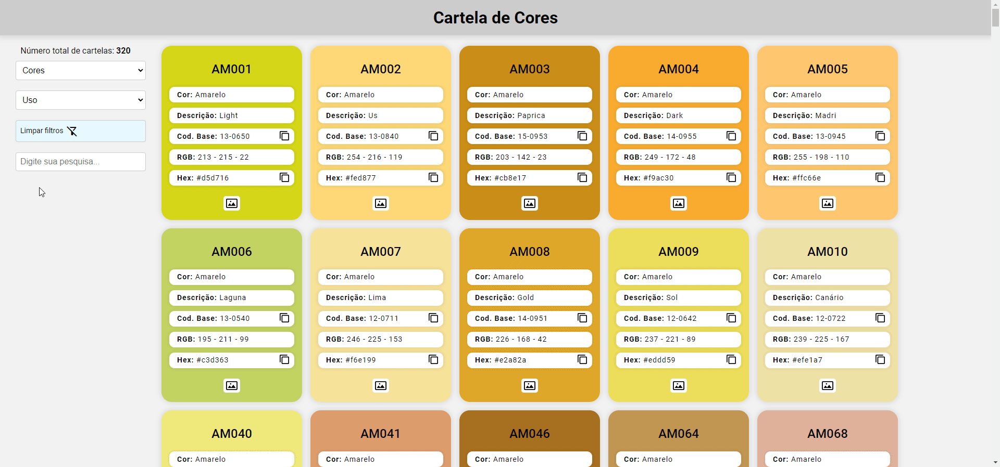

# Cartela de cores

 

# Sobre o projeto

Site simples para consultar cartela de cores.

## Layout web

# Tecnologias utilizadas
## Front end
- HTML
- CSS
- JavaScript

# Autor

Thiago Leoni Amaral

https://linktr.ee/heroleam
